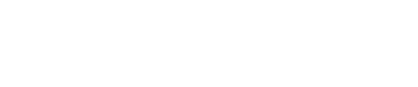

##Welcome to Overseek.net
###About us:

We provide full-scale web applications engineering services to deliver future-oriented and quality-driven products and solutions that are not only market disruptive but user-centric as well.
Accelerating innovation using the latest cutting-edge technology, we’re solving complex challenges and engineering products made to suit each enterprise ecosystem.

###We are using

TypeScript, ReactJS, Node.js, Next.js, NestJS, GraphQL, Apollo
Microservice Architecture Patterns, Docker, Gitlab CI/CD, Magento 2


## We are hiring

###About this job
```markdown

Job type: 		Full-time
Experience level: 	Mid-Level, Senior
Role: 			Full Stack Developer
Industry: 		Educational Technology (EduTech)
Location: 		Oradea, Bihor
E-mail: 		info@overseek.net
```

###Job description

We're looking for an awesome Full Stack Developer to join our team and work with us on bringing online, an evidence-based Social and Emotional learning (SEL) program used in schools worldwide. This project is part of the Educational Technology (EduTech) field and working on it you will take part in the innovations that we will bring to the industry using machine learning and modern web technologies. You'll be working on a microservices designed infrastructure based on Apollo GraphQL, NextJs, NestJs, TypeORM and other cool frameworks.

Our development team advocates for the software craftsmanship approach that emphasizes the coding skills of the software developers. This briefly means you will do professional software development by practicing it and helping others learn the craft and value well-crafted software, you will be adding value to the team and help building a community of professionals looking for constant improvement in their personal and team work.

It’s important to understand that we value the balance between quality of work and business and if this is one of your beliefs, feel free to apply to this job or message us if you need more details.

###About the client
Positive Action is an educational program that is used worldwide in a variety of settings from traditional school settings to counseling programs. It is a market leader for Social and Emotional Learning materials. Designed to create a positive learning environment for students, Positive Action has enabled thousands of organizations to cultivate an intrinsic interest in learning. The Company has a close-knit team developing a highly specialized content delivery platform that will be localized in multiple languages.

###Benefits

At Overseek, we’re always investing in a work-life balance and body-mind health. We want our employees to love it here.

Get the freedom you need to work at your best – with plenty of time for what matters to you most. We offer flexible work schedules, opportunities to work from home, time off for volunteering, and so much more to keep you healthy, safe, and productive. Working from the office, you will get to work from a premium stand-up desk, fully set-up and access to unlimited coffee, tea and snacks. Team and staying-social integration available through at least two team-building events per year, where at least one is international.

- Flexible working hours
- Team buildings
- Competitive salary
- As much leave as needed by team members
- A friendly and talented team that wants you to succeed
- Remote work friendly
- Exposure to brand new emerging technologies
- Brand new laptop
- [Ergoliv standing desk](https://ergoliv.com/shop/)


#
#
#


Markdown is a lightweight and easy-to-use syntax for styling your writing. It includes conventions for

```markdown
Syntax highlighted code block

# Header 1
## Header 2
### Header 3

- Bulleted
- List

1. Numbered
2. List

**Bold** and _Italic_ and `Code` text

[Link](https://ergoliv.com/shop/) and 
```

For more details see [Basic writing and formatting syntax](https://docs.github.com/en/github/writing-on-github/getting-started-with-writing-and-formatting-on-github/basic-writing-and-formatting-syntax).

### Jekyll Themes

Your Pages site will use the layout and styles from the Jekyll theme you have selected in your [repository settings](https://github.com/walhallyus/overseek.net/settings/pages). The name of this theme is saved in the Jekyll `_config.yml` configuration file.

### Support or Contact

Having trouble with Pages? Check out our [documentation](https://docs.github.com/categories/github-pages-basics/) or [contact support](https://support.github.com/contact) and we’ll help you sort it out.
